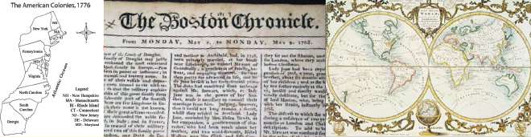

# mapaca
<h1>Music and the Performing Arts in Colonial American Newspapers</h1>
<h2>Welcome to MAPACA</h2>

      
MAPACA is database of more than 53,000
        newspaper articles, advertisements, and illustrations that refer to or
        include music, poetry, or the performing arts in British North America
        between 1704 and 1783. Besides the text, each entry has location
        information about both the publisher and the event reported on, so for
        example, you can ask how many times Boston newspapers reported on bells
        being rung in New York in the wake of the Stamp Act's repeal in 1766, or
        how many times Philadelphia reported on plays performed in other
        colonies or London, mapping the change in frequency between 1704 and
        1783. These sorts of queries can be used, for example, to ask questions
        about the extent of the network of print and the timing of its emergence
        into what Benedict Anderson calls the imagined community in the decades
        before and during the American Revolution. To master the search
        interface's capabilities, we encourage you to read the <a href="http://www.hawaii.edu/arthum/digital/mapaca/help.php"
          title="Help">help file</a>.  Additional support is available from the
        <a href="http://www.hawaii.edu/arthum/digital/forum/index.php?board=2.0">Forum</a>,
        where you can report bugs and suggest features as well.

      
This is the 1.0 release. Advanced queries are possible, but the data is
        returned as a Google-like list of results. The results can be downloaded
        as a CSV file which can then be analyzed using spreadsheet, statistical,
        and data mining software. Searches can be saved and uploaded for later
        use as well.  Contingent on continued support, we plan on incorporating
        cross-tabulated tables and graphing and visualization features for the
        2.0 release.

      
Note on Scope: The use of "America" is aspirational at this point.  The
        original data set was compiled as part of a federal US grant, thus the
        current data is solely a subset of British North American newspapers
        limited anachronistically to the thirteen colonies that would become the
        United States. We hope in the future to expand the data set to include
        the Americas proper, with Canada, the Caribbean, and Central and South
        America represented, but did not want to delay release. The colonial
        moniker holds, since all the presses at this time were in colonies. 
        Plus we like the sound of "MAPACA."

      
 
      

      <button id="getstarted" class="dashbutton">GET STARTED</button>
      <button id="gethelp" class="dashbutton">HELP</button>
      
The
        database was originally compiled by Mary Jane Corry, Kate Van Winkle
        Keller, and Robert M. Keller and released as a CD, <a target="_blank" href="http://www.colonialmusic.org/PAC-cdr.htm">The
          Performing Arts in Colonial American Newspapers, 1690-1783</a> (New
        York: University Music Editions, 1997). The full list of people who
        worked on the CD version can be found in the <a href="http://www.colonialdancing.org/PacanNew/UsersGuide.pdf">user
          guide</a> for their <a target="_blank" href="http://www.colonialdancing.org/PacanNew/Index.htm">web
          site</a>. This interface and the port to a web-based MySQL database is
        a project of the <a target="_blank" href="http://www.hawaii.edu/arthum/digital/">Digital
          Arts and Humanities Initiative</a> at the University of Hawaiʿi at
        Mānoa. <a target="_blank" href="http://www2.hawaii.edu/%7Errath">Richard
          Cullen Rath</a> ported the database to MySQL and designed a user
        interface with David Goldberg, who programmed the new interface. This
        new work was made possible with the generous support of the <a target="_blank"
          href="http://www.hawaii.edu/arthum/">College of Arts and Humanities</a>
        at UHM.

